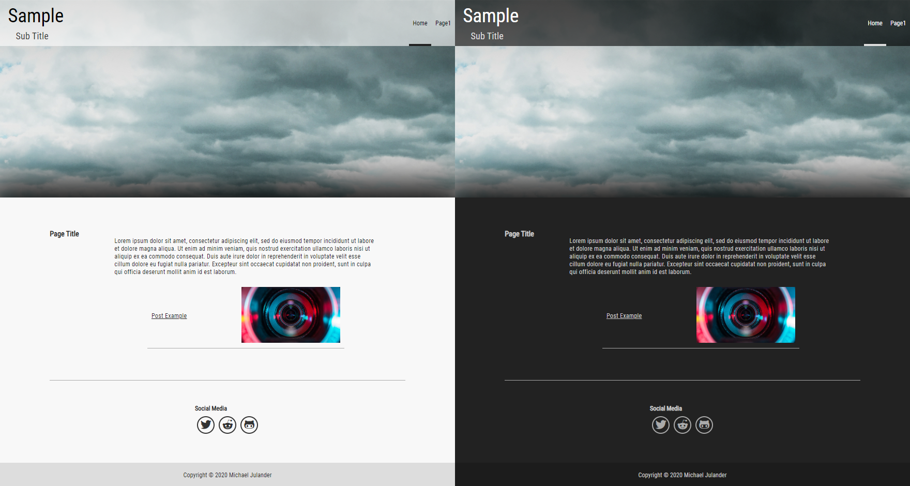

## A nice theme for a nice [framework]. ##

To install this theme go to the `resources` folder in the framework and remove the `theme/` directory then 
run
```
git clone https://github.com/Sodium-Hydrogen/framework-themes.git theme
```

This theme works with v1.0.1 of my framework and supports easy toggling of light and dark mode via the framework's settings menu.

----



----


[framework]: https://github.com/Sodium-Hydrogen/PHP-Framework
